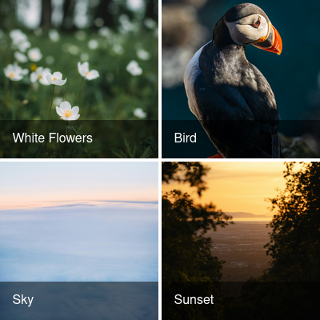

# streamlit-gallery

Streamlit component for displaying multiple images in a grid.

## Example



## Installation instructions

```sh
pip install streamlit-gallery
```

## Usage instructions

```python
import streamlit as st

from streamlit_gallery import streamlit_gallery

images = [
  {
    "src": 'https://images.unsplash.com/photo-1718439111428-f6ef86aae18d',
    "title": 'White Flowers',
  },
  {
    "src": 'https://images.unsplash.com/photo-1718554517666-2978ede88574',
    "title": 'Bird',
  },
  {
    "src": 'https://images.unsplash.com/photo-1711526637497-bd9ecfc68567',
    "title": 'Sky',
  },
  {
    "src": 'https://images.unsplash.com/photo-1717207300523-434099274ff0',
    "title": 'Sunset',
  },
  {
    "src": 'https://images.unsplash.com/photo-1592417817098-8fd3d9eb14a5',
    "title": 'Food',
  },
]

st.subheader("Image gallery")

streamlit_gallery(images=images)
```

## Development instructions

### Frontend

1. `cd streamlit_gallery/frontend`
2. `npm install`
3. `npm run start`

### Streamlit

1. `python -m venv .venv`
2. `pip install -r requirements.txt`
3. `pip install -e .`
4. `streamlit run streamlit_gallery/example.py`